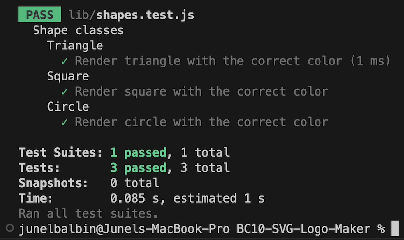
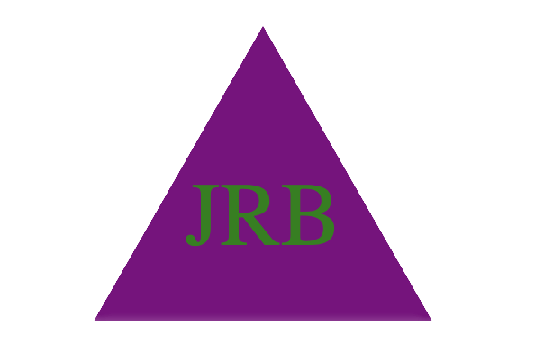
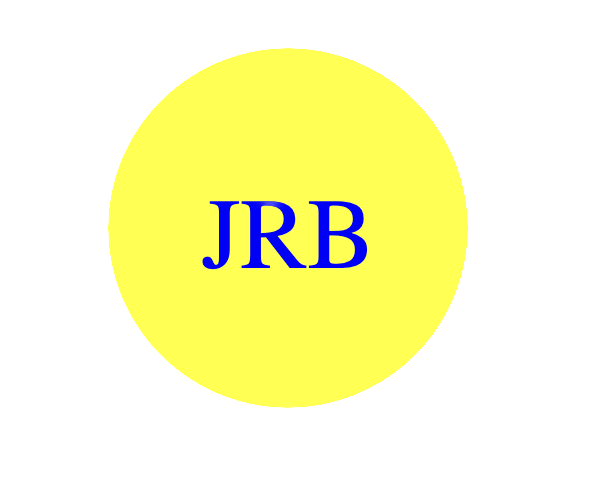

# BC10-SVG-Logo-Maker

## Description:
* A quick simple Node.js command-line application that takes in user input to generate a logo and save it as an SVG file.
* Dynamically generates a logo.svg file from a user's input to select a color and shape, text for the logo and save the generated SVG to a .svg file using the Inquirer package.
* NPM Jest is used for testing purposes for Shapes.js.

## Installation:
* On a web browser please follow the link to begin exploring. [SVG Video Link](https://youtu.be/mWVhidAGI_A)

## Usage:
* Click on the video link provided. [SVG Video Link](https://youtu.be/mWVhidAGI_A)
* Sample of generated logo.svg file. [Generated Sample](https://github.com/Junel-Balbin/BC10-SVG-Logo-Maker/blob/main/logo.svg)

## Application User Interface:
* NPM Test using Jest.

* Generated Shapes: Triangle, Circle & Square.

## Credits & Resources:
* Google search & Youtube videos.
* ChatGpt for troubleshooting.
* Stack Overflow & MDN.
* EdX and UCB.

## Coded With:
* Node.js.
* NPM Test Jest.
* Inquirer Package.
* Visual Studio Code.
* Screencastify.
* Youtube.

## Contributing:
* Any ideas or feedback is very much appreciated.

## License:
* MIT License.